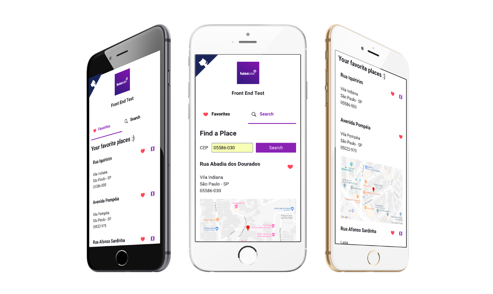

## Luizalabs Front End Test [](https://circleci.com/gh/jeffersonRibeiro/luizalabs-front-end)

<p align="center">
  
</p>

## Basic Overview - [Live Demo](https://luizalabs-229113.firebaseapp.com/)

A Single Page application built with React to search places by CEP and save to favorites. The application is simple but is using advanced techniques of front end development like SPA navigation, state management, unit tests, integration tests, continuous integration, continuous deployment, SASS, scaleable folder structure, ESlint and prettierrc to maintain code styling quality.

**Important:** _To secure my Google Maps API_KEY I've built a Node app and hosted it on Heroku and because of that it may take a while to load the first map if the Heroku app is in sleep mode.
You can check the code [here](https://github.com/jeffersonRibeiro/node-google-static-map-proxy)_

#### Features

- Search for a CEP and add to favorites
- Favorite list persist after page reload
- Responsive
- **Unit tests and integration tests**
- **CircleCI Continuous Integration and Deployment with Firebase**

#### Using

- React
  - Redux - state management
  - React Router - SPA functionality
- Axios - for promise HTTP requests
- CSS
  - BEM methodology
  - SASS
- Moxios - to stub http request
- Enzyme - to mount, shallow, render and query the DOM tree of React components
- Native local storage - to persist products in cart even after page reload
- CircleCI
- Firebase

## About tests

- Unit tests
  - All components have at least a basic smoke test
- **Integration tests**
  - **Search for a CEP and add place to favorite**

### Coverage report


## Build/Run

#### Requirements

- Node.js
- NPM

```javascript

/* First, install the needed packages */
npm install

/* then start the React app */
npm start

/* to run the tests */
npm run test

```

<br/>
<br/>

<p align="center"></p>
<p align="center">
<sub>A little project by <a href="http://www.jeffersonribeiro.com/">Jefferson Ribeiro</a></sub>
</p>
